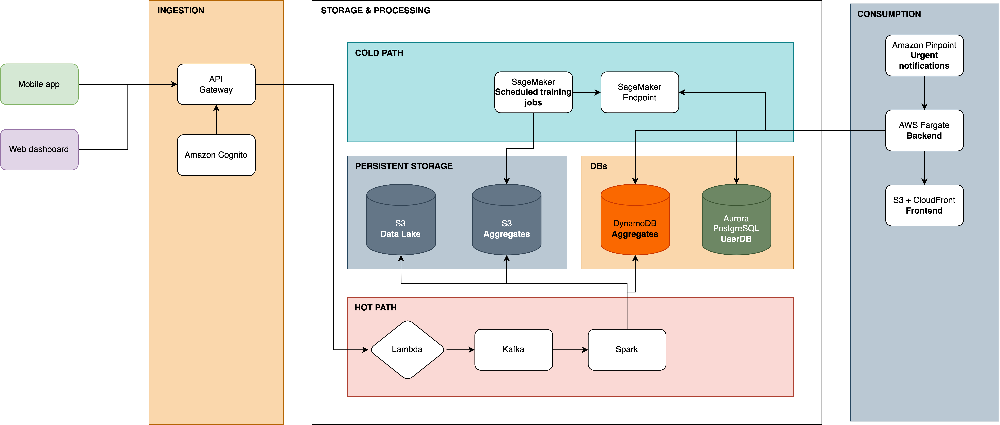

# Cognitive Performance Moniitoring System

## Abstarct
Human error, particularly stemming from fatigue or impaired cognitive readiness, poses a significant risk in high-stakes industries such as logistics, manufacturing, and utilities. The potential for accidents caused by biological factors necessitates a proactive, data-driven approach to worker safety. This project paper outlines the business model and technical architecture of a Cognitive Performance Monitoring System (CPMS), a Software-as-a-Service (SaaS) platform designed to address this challenge. The system captures real-time cognitive indicators by leveraging multimodal data from wearable devices (e.g., activity, sleep) and a worker-facing mobile application (e.g., self-reported stress, diet). This data is processed by a predictive machine learning model to generate a validated "cognitive-readiness score." The system is built on a dual-path, cloud-native architecture (hot/cold) to support both low-latency inference for immediate alerts and robust offline model training. Key outputs include a real-time enterprise dashboard for site managers and proactive alerts for workers whose readiness scores fall below task-specific safety thresholds. The CPMS aims to provide organizations with a privacy-first tool to preemptively identify impairment, enabling timely interventions to prevent accidents, reduce operational liability, and protect worker well-being.



## Structure

Main project structure is following:

```
.
├── app_backend.tf
├── data # on-launch data ingestion
│   ├── cognitive_scores.csv
│   ├── tracking_risks.csv
│   └── users.csv
├── hot_path.tf
├── main.tf
├── ml.tf
├── output.tf
├── scripts
│   ├── db_loader.py # loading /data into UserDB
│   ├── gen_score_requests.py # start simulation for score requests
│   └── gen_wearables.py # start simulation for a stream of wearables data
├── setup_model.py
├── src
│   ├── inference_backend.py
│   ├── ingestion.py
├── terraform.tf
└── variables.tf
```

## Seting up

**Before using terraform, setup your aws cli, you can use 'aws configure' command to apply your credentials**

### To itinitally run the system from very beginning (on new aws), follow next steps
1. Enter aws credentials
2. Comment out ml.tf and inference_app.tf
3. 'Terraform init' -> 'Terraform apply' -> press 'yes'
4. To upload UserDB data run 'python scripts/db_loader.py'
5. To upload a dummy ML model to S3 bucket run 'python setup_model.py'
6. Uncomment ml.tf and inference_app.tf, as without a model in S3 bucket it will raise error -> 'terraform apply'

for details see:
- https://developer.hashicorp.com/terraform
- https://developer.hashicorp.com/terraform/tutorials/aws-get-started/aws-create - great tutorial on aws


### To log in to phAdmin
In credentials use 'abadmin' for a 'Username' field

for more details see: https://docs.aws.amazon.com/AmazonRDS/latest/UserGuide/USER_ConnectToPostgreSQLInstance.pgAdmin.html


### Others

**.env file must contain**
DB_HOST= #db_endpoint
DB_NAME=cpms_user_db
DB_USER=dbadmin
DB_PASS=
SSL_MODE=require
INGEST_URL= #api_url
PREDICT_URL= #prediction_url

To all the necessary data  use 'terraform output'

- for 'setup_model.py' also add BUCKET_NAME= #s3_bucket
- to get 'DB_PASS' use next command in CLI 'aws ssm get-parameter --name "/cognitive-bigdata/db_password" --with-decryption --query "Parameter.Value" --output text --region us-east-1'